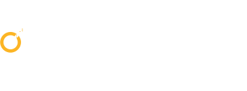

Symantec @ INTERPOL <i>World</i> 2015 may be over but the fight for cybersecurity continues. At the event, Symantec experts shared useful security insights into designing the right proactive protection to achieve today’s cybersecurity goals. 

Information is the key to protecting information. It is thus important to stay up to date about the advanced threats that can bypass the multiple layers of defence in today’s infrastructures. What you need is an authority that has an expansive threat intelligence network and a unified security platform that is effective against today’s attacks. Find out what it takes to move ahead, securely, from Symantec, a global leader in security, storage and systems management solutions.

<a class="btn" href="#attend">Discover speaker highlights &nbsp;</a>

<a class="btn" href="#resources">Watch our videos&nbsp;</a>

